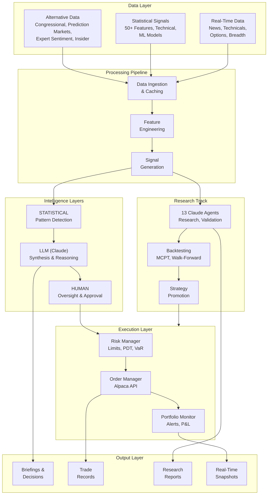
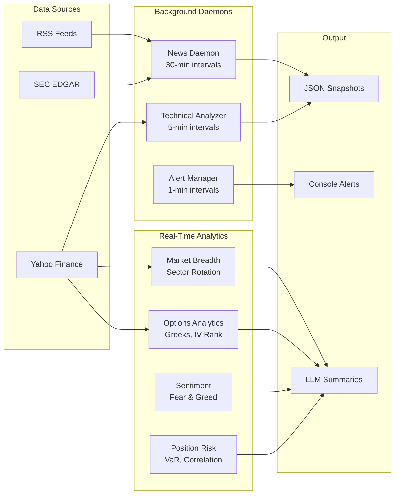

# Project Athena: Hybrid Intelligence Trading System

A trading platform that fuses **statistical alpha generation**, **LLM reasoning**, and **human oversight** for accounts of any size ($200-$25,000+).

---

## The Core Insight

Within algorithmic trading, there exists a largely unexplored middle ground between two dominant paradigms:

### Camp A: Pure Quantitative
Statistical models analyzing price, volume, and technical indicators. Rigorous and systematic, but often blind to the broader context that drives markets.

### Camp B: Pure Discretionary
Human judgment interpreting news, sentiment, and macro conditions. Flexible and contextual, but prone to emotion, bias, and inconsistency.

### Camp C: Hybrid Intelligence (Project Athena)
What if a system could harness the pattern-finding power of statistics, the contextual reasoning of large language models, and the judgment of an informed human? This isn't replacing any single approach but creating something genuinely new: a pipeline where **each layer contributes its unique strength**, and no single point of failure can derail the entire strategy.

---

## System Architecture



---

## Daily Trading Workflow with Claude Code

```mermaid
sequenceDiagram
    autonumber
    participant User
    participant Claude as Claude Code
    participant Data as Data Pipeline
    participant Risk as Risk Manager
    participant Alpaca as Alpaca API

    rect rgb(40, 40, 60)
        Note over User,Alpaca: PRE-MARKET (6:00-9:30 AM ET)
    end

    User->>Claude: /morning-briefing
    Claude->>Data: Fetch overnight news, portfolio, signals
    Data-->>Claude: Aggregated briefing data
    Claude-->>User: Structured morning briefing

    User->>Claude: /trade-decision
    Claude->>Claude: Synthesize signals + latent knowledge
    Claude-->>User: BUY/SELL/HOLD decisions with reasoning

    rect rgb(40, 60, 40)
        Note over User,Alpaca: MARKET OPEN (9:30 AM ET)
    end

    User->>Claude: /execute-trades
    Claude->>Risk: Validate positions, PDT, limits
    Risk-->>Claude: Approval status
    Claude-->>User: Request human approval
    User->>Claude: Approve trades
    Claude->>Alpaca: Submit orders
    Alpaca-->>Claude: Order confirmations
    Claude-->>User: Execution report

    rect rgb(60, 60, 40)
        Note over User,Alpaca: INTRADAY MONITORING (9:30-4:00 PM ET)
    end

    loop Every 30 minutes
        Data->>Data: News daemon check
        Data->>Data: Technical updates
        Data->>Risk: Alert checks
        Risk-->>User: Alerts (if triggered)
    end

    User->>Claude: /monitor (as needed)
    Claude->>Data: Get portfolio status, technicals
    Claude-->>User: Position report with recommendations

    rect rgb(60, 40, 40)
        Note over User,Alpaca: MARKET CLOSE (4:00 PM ET)
    end

    User->>Claude: /eod-review
    Claude->>Alpaca: Fetch day's trades, P&L
    Claude->>Claude: Analyze decisions vs outcomes
    Claude-->>User: Daily review with learnings
```



---

## Quick Start

```bash
# Clone and install
git clone https://github.com/yourusername/quant_suite.git
cd quant_suite
pip install -r requirements.txt

# Configure credentials
cp config/credentials.yaml.example config/credentials.yaml
# Edit with your Alpaca API keys

# Run daily workflow with Claude Code
claude /morning-briefing
claude /trade-decision
claude /execute-trades

# Or run statistical pipeline directly
PYTHONPATH=. python scripts/run_daily.py --mode paper
```

---

## Daily Workflow

| Time (ET) | Command | What Happens |
|-----------|---------|--------------|
| 6:30 AM | `/morning-briefing` | Gather news, portfolio state, alternative data |
| 7:00 AM | `/trade-decision` | Claude synthesizes and makes BUY/SELL/HOLD decisions |
| 7:30 AM | `/execute-trades` | Execute approved trades (human approval required) |
| 9:35 AM | Morning Open Protocol | Auto-assess gap behavior, sector rotation |
| Intraday | `/monitor` | Check positions, alerts, technicals |
| 4:30 PM | `/eod-review` | Analyze outcomes, update learnings |

**Key Innovation**: Claude Code IS the decision engine. Statistical models generate signals, but Claude synthesizes research context and applies latent market knowledge to make final trading decisions with documented reasoning.

---

## Real-Time Trading Infrastructure

The system includes comprehensive intraday monitoring:



### Components

| Component | Location | Purpose |
|-----------|----------|---------|
| **Alert System** | `src/alerts/` | Configurable price, volume, options alerts |
| **Morning Open Protocol** | `src/decision/morning_open.py` | 9:35 AM gap/sector assessment |
| **Intraday Technicals** | `src/data/pipeline/intraday_technicals.py` | S/R, patterns, multi-timeframe |
| **News Daemon** | `src/data/sources/realtime/news_daemon.py` | Continuous news monitoring |
| **Options Analytics** | `src/data/pipeline/options_analytics.py` | Greeks, IV, roll recommendations |
| **Market Breadth** | `src/data/pipeline/market_breadth.py` | Sector rotation, VIX analysis |
| **Sentiment** | `src/data/pipeline/sentiment.py` | Put/call, Fear & Greed, contrarian |
| **Calendar Manager** | `src/data/calendars/calendar_manager.py` | Earnings, economic events |
| **Position Risk Monitor** | `src/risk/position_monitor.py` | VaR, correlation, limits |

---

## Output Directory Structure

All outputs are stored in a configurable results directory (default: `~/quant_results`):

```
quant_results/
├── briefings/              # Morning briefings and daily summaries
├── decisions/              # Trading decisions with reasoning logs
├── trades/                 # Trade execution records
├── trading_logs/           # Detailed session logs
│
├── realtime/               # Real-time intraday data
│   ├── news/               # News snapshots (30-min intervals)
│   ├── technicals/         # Technical analysis snapshots
│   ├── alerts/             # Alert history
│   ├── breadth/            # Market breadth snapshots
│   ├── sentiment/          # Sentiment indicator snapshots
│   └── open_assessments/   # Morning open protocol results
│
├── comprehensive_research/ # Full research cycle outputs
├── research_sessions/      # Text research session data
├── research_reports/       # Analysis reports
├── strategy_reports/       # Strategy documentation
│
├── alpha_discovery/        # Alpha scan results
├── macro_research/         # Geopolitical and macro analysis
├── regime_reports/         # Market regime classifications
│
├── validation_reports/     # Strategy validation (MCPT, walk-forward)
├── critic_reports/         # Safety validation for bias detection
├── options_validation/     # Options strategy validation
├── plots/                  # Strategy visualizations
│
├── promotions/             # Strategy promotion records
├── paper_trading/          # Paper trading outputs
├── pdt/                    # PDT compliance tracking
├── performance_reports/    # Performance analytics
│
├── scraped_data/           # Alternative data cache
├── sessions/               # Session-based research data
└── archive/                # Historical data
```

### Configuring Output Location

```bash
# Default (uses ~/quant_results)
python scripts/run_trading.py

# Custom location
QUANT_RESULTS_DIR=/data/trading/results python scripts/run_trading.py
```

Or use the PathConfig programmatically:

```python
from src.core.paths import paths

# Access directories
briefing_dir = paths.briefings
decisions_dir = paths.decisions
realtime_news = paths.realtime_news
realtime_alerts = paths.realtime_alerts
```

---

## Features

### Alternative Data Sources

| Source | Signals |
|--------|---------|
| Congressional Trades | Cluster buying (Pelosi, committee members) |
| Prediction Markets | Fed policy, recession odds, macro events |
| Expert Sentiment | Inverse Cramer, follow/fade pundits |
| Insider Trading | SEC Form 4 cluster buying |
| Options Flow | Unusual activity, institutional positioning |
| News/Reddit | Sentiment, trending tickers |

### PDT Compliance

For accounts under $25,000:
- Tracks 3 day trades per 5 rolling days
- Enforces 2-day minimum hold for swings
- PDTManager for real-time capacity tracking

### Intraday Trading

- VWAP bounce strategy
- Momentum continuation
- ATR-based stops and targets
- Session phase awareness (opening, power hour)

### Research Framework

- 13 specialized Claude Code agents
- MCPT validation (p < 0.05 required)
- Walk-forward testing
- Critic validation for bias detection

---

## Claude Code Integration

### Skills (11)

**Daily Trading:**
- `/morning-briefing` - Pre-market research
- `/trade-decision` - LLM decision engine
- `/execute-trades` - Execute with approval
- `/eod-review` - Daily analysis

**Research:**
- `/research`, `/validate`, `/critic`, `/brainstorm`, `/promote`, `/monitor`, `/report`

### Agents (13)

**Research:** research-agent, research-worker-agent, alpha-discovery-agent, hypothesis-generator-agent, brainstorm-agent

**Market Intelligence:** macro-research-agent, news-analyst-agent, regime-detector-agent

**Operations:** critic-agent, monitor-agent, data-acquisition-agent, orchestrator-agent

---

## Validation Requirements

Before production:
- **MCPT p-value < 0.05** (Monte Carlo Permutation Test)
- **Out-of-sample Sharpe > 0.5**
- **Critic validation** (no lookahead bias, overfitting)

```python
from src.evaluation.validation.mcpt import mcpt_test
result = mcpt_test(strategy_returns, benchmark_returns, n_permutations=1000)
print(f"p-value: {result.p_value:.4f}")
```

---

## Trading Rules

| Rule | Value |
|------|-------|
| Max single position | 25% |
| Max sector exposure | 40% |
| Max daily loss | 5% |
| Stop loss | 5-15% |
| PDT day trades | 3 per 5 days |
| Min swing hold | 2 days |

---

## Documentation

| Document | Purpose |
|----------|---------|
| `CLAUDE.md` | Claude Code reference |
| `docs/EVALUATION_API.md` | Backtesting, validation |
| `docs/ALPHA_DISCOVERY.md` | Alternative data |
| `docs/REALTIME_DATA_SPEC.md` | Real-time infrastructure spec |
| `docs/TRADING_GUIDE.md` | User guide |
| `DEVLOG.md` | Development log |
| `RESEARCH_LOG.md` | Research findings |

---

## License

MIT
